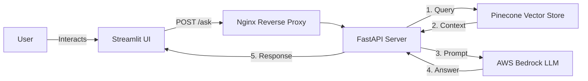

# Python Programming Q&A Assistant

This project is an AI-powered Python Q&A system built for the Analytics Vidhya AI Engineer Assessment. It utilizes a robust Retrieval-Augmented Generation (RAG) pipeline to provide accurate, context-grounded answers based on the Stack Overflow Python Questions & Answers dataset.

## Architecture

The system is optimized to run on **Free Tier** cloud services with a modern UI:
- **Frontend UI**: Streamlit (Chat Interface)
- **Backend API**: FastAPI
- **Vector Database**: Pinecone Cloud (Free Tier)
- **LLM & Embeddings**: AWS Bedrock (Qwen via Amazon Bedrock / Titan Text Embeddings v2)
- **Deployment**: AWS EC2 `t2.micro` via Docker Compose



## Features

- **Interactive UI**: A fully functional ChatGPT-like Streamlit frontend to interact with the API.
- **RAG Pipeline with BM25 Reranking**: Hybrid retrieval — Pinecone semantic search followed by BM25 keyword reranking for higher-quality context.
- **FastAPI Backend**: Exposes a POST `/ask` endpoint for questions and a GET `/health` endpoint for monitoring.
- **Parallel Data Ingestion**: The `upload_to_pinecone.py` script utilizes `ThreadPoolExecutor` and `tqdm` to parallelize data chunking and vector uploads, drastically reducing setup time.
- **CI/CD Pipeline**: GitHub Actions workflow (`.github/workflows/deploy.yml`) auto-deploys to EC2 on every push to `main` — copies code via SCP, injects secrets, and rebuilds Docker containers.
- **Dockerized**: Containerized for easy deployment, carefully balanced across three containers (`app`, `streamlit`, `nginx`) to fit within the `t2.micro` 1GB memory constraints.

---

## 🛠️ Setup Instructions (Local)

1. **Clone the repository**:
   ```bash
   git clone <repository_url>
   cd <repository_folder>
   ```

2. **Set up a Virtual Environment**:
   ```bash
   python -m venv venv
   # On Windows:
   venv\Scripts\activate
   # On Mac/Linux:
   source venv/bin/activate
   
   pip install -r requirements.txt
   ```

3. **Configure Environment Variables**:
   Copy the example config and fill in your actual credentials.
   ```bash
   cp .env.example .env
   ```
   *Required variables*: AWS credentials (`AWS_ACCESS_KEY_ID`, `AWS_SECRET_ACCESS_KEY`), Pinecone credentials (`PINECONE_API_KEY`).

4. **Prepare the Data**:
   Download the [Stack Overflow dataset from Kaggle](https://www.kaggle.com/datasets/stackoverflow/pythonquestions) and place `Questions.csv`, `Answers.csv`, and `Tags.csv` inside `app/data/raw/`.

5. **Upload to Pinecone & S3**:
   Run the data ingestion script to build your vector index in the cloud. This script has been optimized with parallel processing and progress bars.
   ```bash
   python scripts/upload_to_pinecone.py
   ```

6. **Run the Application Locally (via Docker)**:
   ```bash
   docker-compose up -d --build
   ```
   - **Frontend UI**: http://localhost:8501
   - **Backend API**: http://localhost:8000
   - **API Docs (Swagger)**: http://localhost:8000/docs

---

## 🚀 Deployment Guide (AWS EC2 Free Tier)

1. **Launch a Free Tier EC2 Instance**:
   - Ubuntu Server 22.04 LTS (t2.micro)
   - Ensure Security Group allows HTTP (80), API (8000), and Streamlit (8501), plus SSH (22).

2. **Transfer Code to EC2**:
   ```bash
   scp -i your-key.pem -r app/ frontend/ infrastructure/ docker-compose.yml Dockerfile requirements.txt .env setup_free_tier.sh ubuntu@<ec2-public-ip>:~/python-qa-aws/
   ```

3. **SSH and Setup**:
   ```bash
   ssh -i your-key.pem ubuntu@<ec2-public-ip>
   cd ~/python-qa-aws
   chmod +x setup_free_tier.sh
   ./setup_free_tier.sh
   ```

4. **Start the Application**:
   ```bash
   docker-compose up -d --build
   ```

The application UI will be live at `http://<ec2-public-ip>:8501`.

---

## 🧪 Testing

You can test the API directly using curl or Swagger UI (`/docs`), or interact with the user-friendly Streamlit Frontend (`:8501`).

```bash
curl -X POST "http://<your-ec2-ip>:8000/ask" \
     -H "Content-Type: application/json" \
     -d '{"question": "How do I reverse a list in Python?"}'
```
